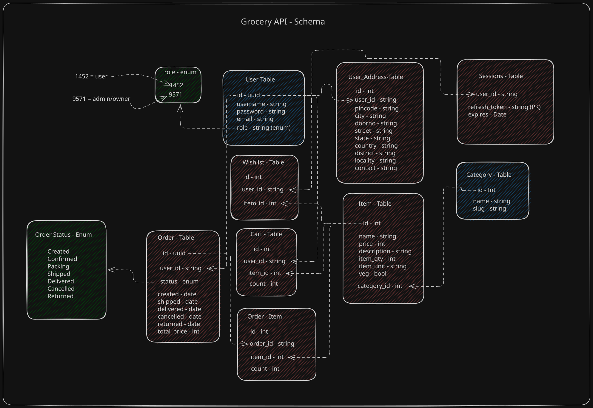

# JWT API Trials:

> [!warning]
> This api got an huge flaw, Everytime an user sign-in, a new refresh-token is created in the DB. A malicious attacker can abuse it and make the DB unnecessarily crowded. 
>
> **To mitigate** this try to re-use the refresh-token from DB during sign-in. 
>
> Also limit no of active sessions (maybe like 3 or 4)
>
> Also run an periodic script to delete expired tokens. **OR** Delete expired tokens during `/auth/refresh` and `/auth/logout`.
>
> ### What i did?
> Add a check in => `/auth/sign-in` to see if user has more than 3 sessions in DB, if they did => I'll delete all the previous sessions in the DB before creating the current one. I'm only allowing 4 active sessions. **THIS IS NOT AN IDEAL SOLUTION, but this is an sample project i developed for the sole purpose to test my python-automation skills so...**
>

> [!warning]
> **Another flaw is strong-password check is not implemented.**


I'm building an Groceries API, It's functionalities are:

- List Groceries seperated by Categories
- Add/Remove to User's Cart
- Edit/Delete Category Info
- View/Edit/Delete Grocery Item Info
- Add/Remove to User's Wishlist (Favorites)
- Create/Update/Delete order for User

It has three roles:
- Visitor
- User
- Owner/Admin


## Roadmap:
- [x] Basic Setup
- [x] Setup Sqlite DB using Drizzle
- [x] Write Schema
- [x] Add Category API
- [x] Json-Syntax-Error Handler
- [x] Master Error Handler
- [x] Zod Error Handler
- [x] 404 HANDLER
- [x] Already Exists Error Handler
- [ ] Setup Authentication & Authorization
  - [x] Write the JWT Structure and functions
  - [x] /sign-up
  - [x] /sign-in
  - [x] /refresh
  - [x] /logout
  - [ ] Role-based Authorization Middleware
- [ ] Edit Category Api
- [ ] Delete Category Api
- [ ] Add Item Api
- [ ] Delete Item API
- [ ] Edit Item API
- [ ] List Category API
- [ ] View Item API
- [ ] Add Item to Cart API
- [ ] Remove Item from Cart API
- [ ] Clear User Cart API
- [ ] Add Item to Favorite API
- [ ] Remove Item from Favorite API
- [ ] Edit User Location API
- [ ] Edit User - Name API
- [ ] Delete User API
- [ ] ...
- [ ] ...
- [ ] ...
- [ ] ...


## Schema(s):



- [x] User-Table

- [x] User-Address-Table

- [x] Session-Table

- [x] Category-Table

- [x] Item-Table

- [x] Wishlist-Table

- [x] Cart-Table

- [x] Order-Table

- [x] Order-Item-Table

## Auth Info:

### Access-Token Structure:
```js
 sign(
  {userId:"122-ad21-112", username:"foo", role: "0000"}, 
  ACCESS_SECRET, 
  {expiresIn:"6h"}
 ); // expiresIn: 6 hours
```
### Refresh-Token Structure:
```js
sign(
  {username: "foo"},
  REFRESH_SECRET,
  {expiresIn: "3d"}
); // expiresIn: 3 days
```
### Bearer Token Structure:
```js
"Bearer jwt-comes-here"
```